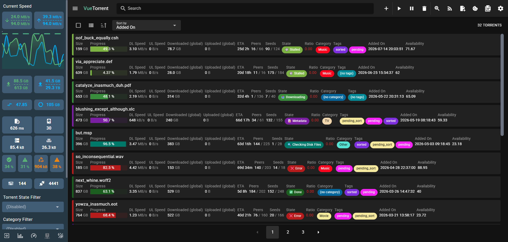
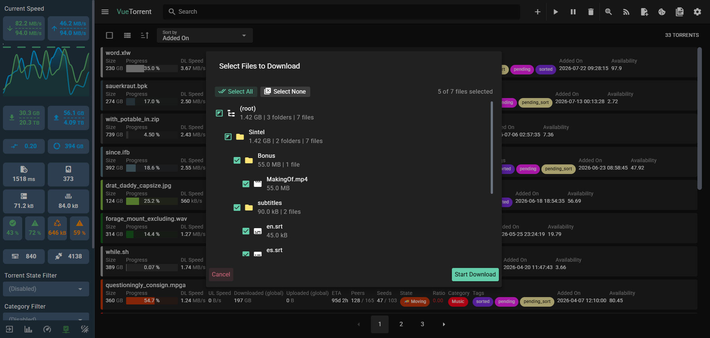
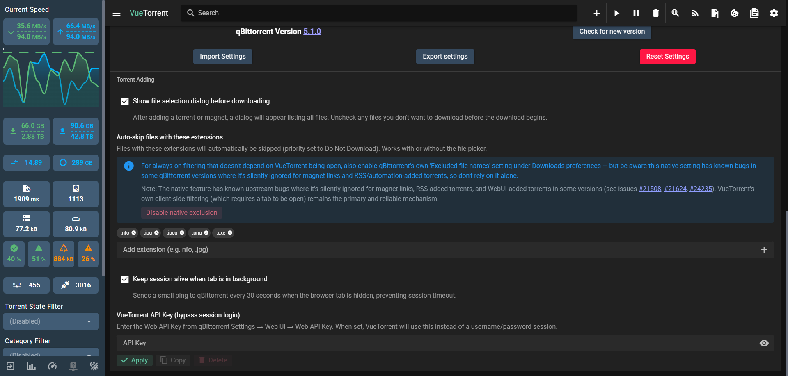
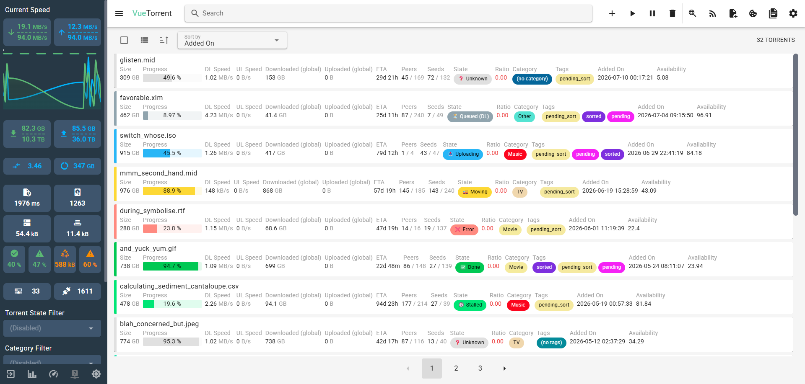
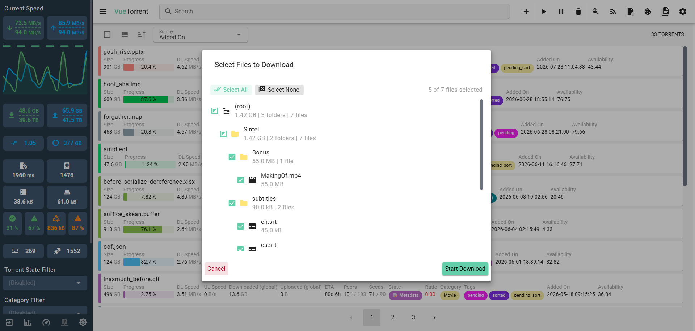

# VueTorrent-NX

The sleekest, most robust WebUI for qBittorrent — built with Vue.js!

[](https://discord.gg/KDQP7fR467)
 


---

## 📸 Screenshots

### Dark Mode
<p>
  
</p>
<p>
  
</p>
<p>
  
</p>

### Light Mode
<p>
  
</p>
<p>
  
</p>

---

## ✨ What Makes VueTorrent-NX Different?

VueTorrent-NX is a hardened, automation-friendly, and meticulously polished fork of the original VueTorrent WebUI. While the original VueTorrent is a beautiful visual skin for qBittorrent, it suffers from several concurrency, persistence, and file-picker race conditions when used alongside *arr stack automation (Sonarr, Radarr, etc.).

**VueTorrent-NX introduces the following critical fixes and major features:**

- **Automation Safety:** Prevents the manual file-picker dialog from accidentally intercepting or locking up background torrents added by external APIs (like Sonarr/Radarr).
- **Concurrency Guards:** Introduces strict `activeLocalAdds` guards and `try/finally` safety wrappers to prevent race conditions during rapid UI-initiated adds, keeping your *arr stack functioning smoothly in the background.
- **Robust Hash Resolution:** Replaces fragile strict-equality string matching for `.torrent` uploads with a resilient fuzzy-matching algorithm and a timestamp-based fallback, ensuring the WebUI never fails to resolve a torrent hash.
- **Native Exclusion Syncing:** The Pre-Download File Selection dialog now seamlessly reads your native qBittorrent `excluded_file_names` setting! When you add a new torrent, any files matching your native exclusions (like `*.exe` or `*.txt`) are automatically deselected in the beautiful Vue UI before the download even begins. It also correctly manages this state without permanent native pollution, allowing "Reset Settings" to cleanly wipe exclusions.
- **Independent CI/CD:** Uses a completely streamlined, standard GitHub Actions release pipeline tailored for this fork, abandoning the complex upstream pipelines.

---

## 💾 Installation

Upgrading to VueTorrent-NX is incredibly simple:

1. Head over to our [Releases](https://github.com/jt-ito/VueTorrent-NX/releases) page.
2. Download the latest `vuetorrent.zip`.
3. Extract the folder to a convenient location on your system.
4. Open your qBittorrent settings, navigate to **Web UI**, and check **Use alternative Web UI**.
5. Point the path directly to your extracted `vuetorrent` directory.
6. Refresh your browser, and enjoy!

---

## 🛠️ Development

Want to compile it yourself or contribute?

```bash
# Clone the repository
git clone https://github.com/jt-ito/VueTorrent-NX.git
cd VueTorrent-NX

# Install dependencies
npm install

# Start the local dev server
npm run dev

# Compile for production
npm run build
```

> **Note:** Make sure WebUI > "Host header validation" is disabled in your qBittorrent preferences if you are accessing it locally for development!

---

## ⚠️ Important Information

### Reverse Proxy & Timeouts
If you're running VueTorrent-NX behind a reverse proxy (like Nginx, Traefik, or Caddy) or a CDN (like Cloudflare), be aware of connection timeouts:
- **CDN/Edge Timeout:** Cloudflare (Proxied / Orange Cloud) has a default idle connection timeout (around 100s on the free tier).
- **Reverse Proxy Timeout:** Nginx utilizes its own `proxy_read_timeout` and `proxy_send_timeout` directives.
- **qBittorrent Session:** Sessions are handled natively by VueTorrent's background keep-alive ping.

*Tip: Ensure your proxy settings allow long-lived connections for API endpoints if you encounter abrupt disconnects.*

### Native "Excluded File Names" Feature (Complementary)
For always-on filtering that doesn't depend on VueTorrent being open in a tab, you can enable qBittorrent's native **"Excluded file names"** setting under your Downloads preferences. 

However, please note that this native setting has known bugs in some qBittorrent versions (e.g. 5.0 - 5.2) where it is silently ignored for magnet links, RSS feeds, and automation-added torrents (see qBittorrent issues #21508, #21624, #24235). VueTorrent-NX provides its own robust client-side filter to bridge this gap, but the native setting remains a fantastic complementary layer!

---

## 🤝 Support & Issues

If you encounter any issues—especially those specific to this fork's automation guards, file-picker logic, or release builds—please [open an issue](https://github.com/jt-ito/VueTorrent-NX/issues) on this repository. We're always looking to improve!
