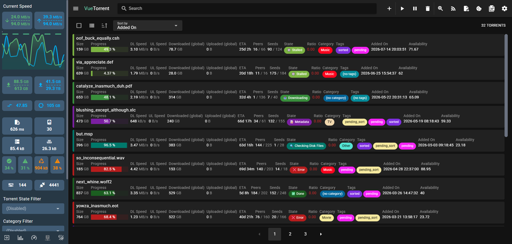
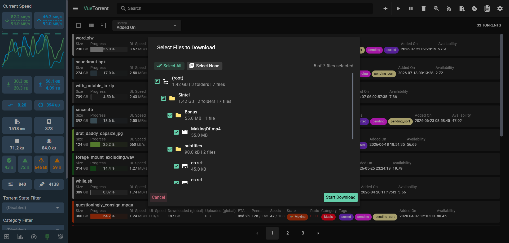
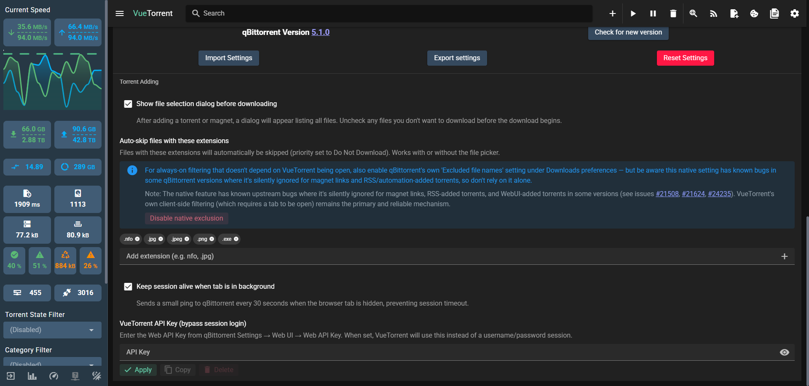
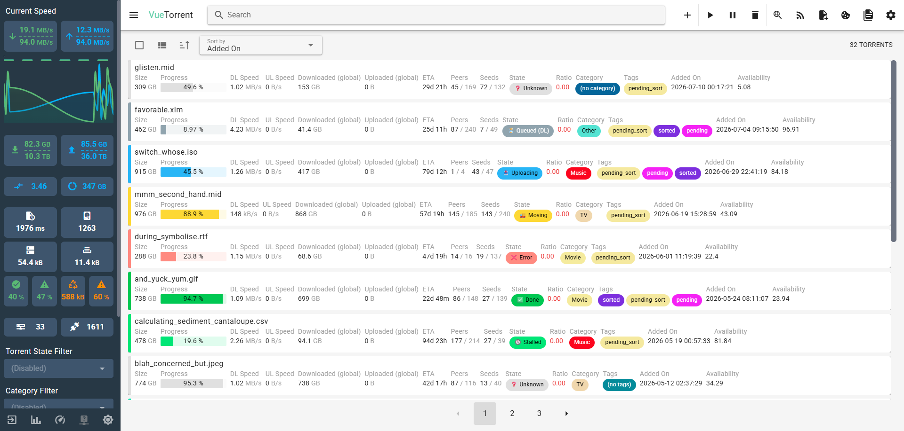
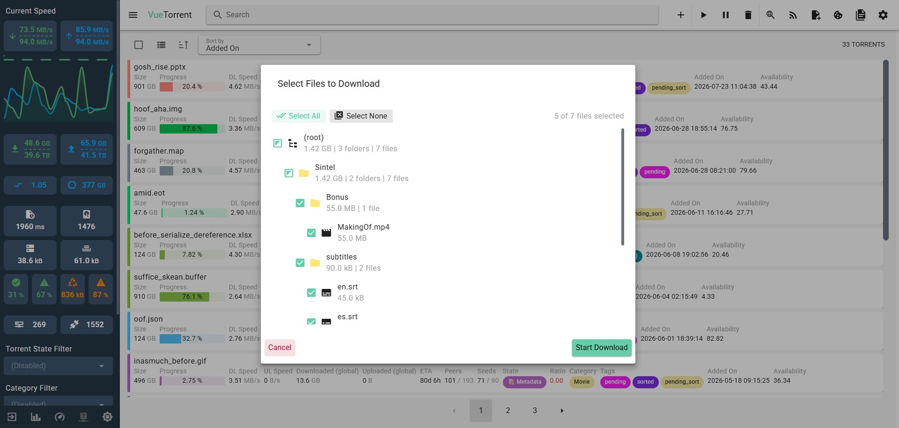

# VueTorrent-NX

The sleekest, most robust WebUI for qBittorrent — built with Vue.js!

 


---

## 📸 Screenshots

### Dark Mode
<p>
  
</p>
<p>
  
</p>
<p>
  
</p>

### Light Mode
<p>
  
</p>
<p>
  
</p>

---

## ✨ What Makes VueTorrent-NX Different?

VueTorrent-NX is a hardened, automation-friendly, and meticulously polished fork of the original VueTorrent WebUI. While the original VueTorrent is a beautiful visual skin for qBittorrent, it suffers from several concurrency, persistence, and file-picker race conditions when used alongside *arr stack automation (Sonarr, Radarr, etc.).

**VueTorrent-NX introduces the following critical fixes and major features:**

- **Automation Safety:** Prevents the manual file-picker dialog from accidentally intercepting or locking up background torrents added by external APIs (like Sonarr/Radarr).
- **Concurrency Guards:** Introduces strict `activeLocalAdds` guards and `try/finally` safety wrappers to prevent race conditions during rapid UI-initiated adds, keeping your *arr stack functioning smoothly in the background.
- **Robust Hash Resolution:** Replaces fragile strict-equality string matching for `.torrent` uploads with a resilient fuzzy-matching algorithm and a timestamp-based fallback, ensuring the WebUI never fails to resolve a torrent hash.
- **Native Exclusion Syncing & Bypassing Upstream Engine Bugs:** Solves the notorious qBittorrent bug where native file exclusions (`excluded_file_names`) are silently ignored for magnet links, RSS feeds, and API additions. VueTorrent-NX synchronizes exclusions seamlessly and provides both client-side polling and hardened background scripts to guarantee files are deselected.
- **Packaged Hardened Background Hook:** Bundles zero-dependency native scripts (`auto_exclude.sh` for Linux/Docker/macOS, `auto_exclude.ps1` for Windows, `auto_exclude.py`) so exclusions apply even when your browser is closed.
- **Independent CI/CD:** Uses a completely streamlined, standard GitHub Actions release pipeline tailored for this fork, abandoning the complex upstream pipelines.

---

## 💾 Installation

Upgrading to VueTorrent-NX is incredibly simple:

1. Head over to our [Releases](https://github.com/jt-ito/VueTorrent-NX/releases) page.
2. Download the latest `vuetorrent.zip`.
3. Extract the folder to a convenient location on your system.
4. Open your qBittorrent settings, navigate to **Web UI**, and check **Use alternative Web UI**.
5. Point the path directly to your extracted `vuetorrent` directory.
6. Refresh your browser, and enjoy!

---

## 🛠️ Development

Want to compile it yourself or contribute?

```bash
# Clone the repository
git clone https://github.com/jt-ito/VueTorrent-NX.git
cd VueTorrent-NX

# Install dependencies
npm install

# Start the local dev server
npm run dev

# Compile for production
npm run build
```

> **Note:** Make sure WebUI > "Host header validation" is disabled in your qBittorrent preferences if you are accessing it locally for development!

---

## ⚠️ Important Information

### Reverse Proxy & Timeouts
If you're running VueTorrent-NX behind a reverse proxy (like Nginx, Traefik, or Caddy) or a CDN (like Cloudflare), be aware of connection timeouts:
- **CDN/Edge Timeout:** Cloudflare (Proxied / Orange Cloud) has a default idle connection timeout (around 100s on the free tier).
- **Reverse Proxy Timeout:** Nginx utilizes its own `proxy_read_timeout` and `proxy_send_timeout` directives.
- **qBittorrent Session:** Sessions are handled natively by VueTorrent's background keep-alive ping.

*Tip: Ensure your proxy settings allow long-lived connections for API endpoints if you encounter abrupt disconnects.*

### The Upstream Auto-Exclusion Bug & How We Bypass It

qBittorrent features a native "Excluded file names" option (`preferences.excluded_file_names`), but it suffers from severe upstream C++ engine bugs:
- **The Bug:** In qBittorrent (issues [#21508](https://github.com/qbittorrent/qBittorrent/issues/21508), [#21624](https://github.com/qbittorrent/qBittorrent/issues/21624), [#24235](https://github.com/qbittorrent/qBittorrent/issues/24235)), native exclusions **only work when adding a `.torrent` file that already contains metadata**. When adding torrents via **magnet links**, **RSS feeds**, or **automation APIs (Radarr, Sonarr, etc.)**, qBittorrent completely ignores the exclusion list and downloads dangerous or unwanted files (such as `.exe`, `.lnk`, `.bat`) anyway!

#### How VueTorrent-NX Bypasses It:
VueTorrent-NX solves this with a two-tier, zero-gap approach:

1. **Active WebUI Mode (Browser Open):**
   - VueTorrent-NX intercepts newly added torrents and actively monitors metadata status (`waitForMetadata`).
   - The moment files become available, VueTorrent deselects all matching extensions with Priority 0 (`DO_NOT_DOWNLOAD`) before pieces begin downloading.

2. **Headless / Background Mode (Browser Closed & Automation):**
   - Packaged directly inside `vuetorrent/scripts/` are hardened, native scripts that hook into qBittorrent's **"Run external program on torrent added"** (`autorun_on_torrent_added_program`):
     - **Docker, Linux, & macOS:** `auto_exclude.sh` — 100% native, using `/bin/sh`, `curl`, and `awk` already built into Linux, Alpine, and Docker containers (no Python or pip packages required). If `python3` is available (such as in `linuxserver/qbittorrent`), it seamlessly uses Python.
     - **Windows:** `auto_exclude.ps1` — 100% native, using built-in Windows PowerShell (`Invoke-RestMethod`) with zero extra installs required.
     - **Universal Python:** `auto_exclude.py` — standard library Python 3.6+ with zero third-party dependencies.
   - **Dynamic Synchronization:** The scripts fetch `GET /api/v2/app/preferences` on every run. Any extensions you add or edit in VueTorrent-NX are immediately and automatically respected by the background hook.
   - **Anti-Exploit Security:**
     - **Strict Hash Validation:** Hashes are strictly verified against `^[a-fA-F0-9]{40}([a-fA-F0-9]{24})?$` to prevent command injection and shell metacharacter exploits.
     - **Protocol Enforcement:** Enforces `http://` or `https://` only, mitigating SSRF risks.
     - **Integer ID Validation:** All file indices are strictly cast to integers before dispatching priority updates.
     - **Secure Temporary Files:** Restricts cookie permissions (`0600`) with automatic exit traps.
   - **Logging & Disk Protection:** Every event is timestamped (`[YYYY-MM-DD HH:MM:SS] [LEVEL]`) and written to both console and a rolling `auto_exclude.log` capped at 5 MB so it will never consume host disk space.
   - **Automated Configuration:** When you add your first exclusion in VueTorrent-NX Settings, the WebUI prompts you and can automatically configure qBittorrent's hook for your detected OS with a single click.

---

## 🤝 Support & Issues

If you encounter any issues—especially those specific to this fork's automation guards, file-picker logic, or release builds—please [open an issue](https://github.com/jt-ito/VueTorrent-NX/issues) on this repository. We're always looking to improve!
